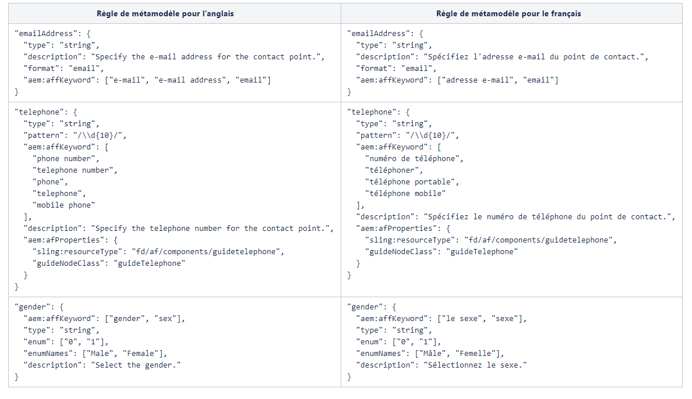

# Étendre le métamodèle par défaut {#extend-the-default-meta-model}

Le service de conversion automatisée de formulaires identifie et extrait les objets de formulaire des formulaires sources. Le mappeur sémantique aide le service à décider comment les objets extraits sont représentés dans un formulaire adaptatif. Par exemple, un formulaire source peut représenter une date de plusieurs façons différentes. Le mappeur sémantique permet de mapper toutes les représentations des dates du formulaire source avec les composants de date des formulaires adaptatifs. Le mappeur sémantique permet également au service de préconfigurer et d’appliquer des validations, des règles, des modèles de données, du texte d’aide et des propriétés d’accessibilité aux composants de formulaires adaptatifs pendant la conversion.


Le métamodèle est un schéma JSON. Avant de commencer, assurez-vous de bien maîtriser JSON. Vous devez avoir de l’expérience dans la création, l’édition et la lecture de données enregistrées au format JSON.

## Métamodèle par défaut {#default-meta-model}

Le service de conversion automatisée de formulaires comprend un métamodèle par défaut. Il s’agit d’un schéma JSON qui se trouve sur Adobe Cloud avec d’autres composants du service de conversion automatisée de formulaires. Une copie du métamodèle est disponible sur votre serveur AEM local à l’adresse suivante :  http://&lt;serveur>:&lt;port>/aem/forms.html/content/dam/formsanddocuments/metamodel/`global.schema.json`. Vous pouvez également [cliquer ici](assets/en.globalschema.json) pour accéder au schéma de langue anglaise et le télécharger. Les métamodèles pour le [français](assets/fr.globalschema.json), l’[allemand](assets/de.globalschema.json), l’[espagnol](assets/es.globalschema.json), l’[italien](assets/it.globalschema.json) et le [portugais](assets/pt_br.globalschema.json) peuvent également être téléchargés.

Le schéma du métamodèle dérive des entités de schéma figurant sur https://schema.org/docs/schemas.html. Il inclut notamment les entités Person, PostalAddress et LocalBusiness définies sur https://schema.org. Chaque entité du métamodèle correspond au type d’objet de schéma JSON. Le code suivant représente un exemple de structure de métamodèle :

```
   "Entity": {
      "id": "Entity",
      "properties": {
        "name": {
          "type": "string"
        },

        "description": {
          "type": "string",
          "description": "Description of the item"
        }
      }
    }
```

## Télécharger le métamodèle par défaut {#download-the-default-meta-model}

Pour télécharger le métamodèle par défaut sur le système de fichiers local, procédez comme suit :

1. Connectez-vous à l’instance AEM Forms.
1. Accédez au dossier **[!UICONTROL Formulaires]** > **[!UICONTROL Formulaires et documents]** **>** **[!UICONTROL Métamodèle]**.
1. Sélectionnez le fichier **[!UICONTROL global.schema.json]** et appuyez sur **[!UICONTROL Télécharger]**. Une boîte de dialogue de téléchargement s’affiche. Sélectionnez l’option **[!UICONTROL Télécharger le ou les actifs sous forme de fichiers binaires]**. Appuyez sur **[!UICONTROL Télécharger]**. Une archive est téléchargée.

   <!--
   Comment Type: draft

   <li><p>Extract the archive and open the global.schema.json file for editing. </p> </li>
   -->

   <!--
   Comment Type: draft

   <li>Step text</li>
   -->

## Comprendre le métamodèle {#understanding-the-meta-model}

Un métamodèle fait référence à un fichier de schéma JSON qui contient des entités. Toutes les entités du fichier de schéma JSON incluent un nom et un identifiant. Chaque entité peut comprendre plusieurs propriétés. Les entités et leurs propriétés peuvent varier en fonction du domaine. Vous pouvez étendre un fichier de schéma à l’aide de mots-clés et de configurations de champs pour mapper les propriétés de schéma aux composants de formulaires adaptatifs.

```
"Event": {
      "id": "Eventid",
      "allOf": [
        {
          "$ref": "#Entity"
        },
        {
          "properties": {
            "startDate": {
              "type": "string",
              "format": "date",
              "description": "Specify the start date and time of the event in ISO 8601 date format."
            },
            "endDate": {
              "type": "string",
              "format": "date",
              "description": "Specify the end date and time of the event in ISO 8601 date format."
            },
            "location": {
              "$ref": "#PostalAddress",
              "description": "Specify the location of the event."
            }
          }
        }
      ]
    }
```

Dans cet exemple, **Événement** représente le nom d’une entité dont la valeur **id** est **Eventid**. L’entité Événement comprend plusieurs propriétés :

* startDate
* endDate
* location

Le concept **allOf** dans le métamodèle permet l’héritage entre les entités.

Chaque propriété peut en outre inclure :

* [Propriétés du schéma JSON](#jsonschemaproperties)
* [Recherche par mots-clés pour appliquer des propriétés aux champs de formulaires adaptatifs générés](#keywordsearch)
* [Propriétés supplémentaires](#additionalproperties)


Sur la base des mots-clés référencés à l’aide de **aem:affKeyword**, le service de conversion effectue une opération de recherche sur les champs du formulaire source. Le service de conversion applique les propriétés du schéma JSON et les propriétés supplémentaires aux champs qui répondent aux critères de recherche.

Dans cet exemple, le service de conversion recherche les mots-clés suivants dans le fichier source : phone, telephone, mobile phone, work phone, home phone, telephone number, telephone no et phone number. Selon les champs dans lesquels figurent ces mots-clés, le service de conversion applique le type, le modèle et aem:afProperties aux champs du formulaire adaptatif après la conversion.

### Propriétés du schéma JSON pour les champs de formulaires adaptatifs générés {#jsonschemaproperties}

Le métamodèle prend en charge les propriétés communes du schéma JSON suivantes pour les champs de formulaires adaptatifs générés à l’aide du service de conversion automatisée de formulaires :

<table> 
 <tbody> 
  <tr> 
   <th><strong>Nom de la propriété</strong></th> 
   <th><strong>Description</strong></th> 
  </tr> 
  <tr> 
   <td><p>title</p></td> 
   <td> 
    <p>Le texte mentionné dans la propriété title d’un métamodèle sert de mot-clé de recherche pour effectuer des actions sur les champs de formulaires adaptatifs générés (par exemple, la modification du libellé d’un champ de formulaire adaptatif). Pour en savoir plus, consultez la section <strong>Modifier le libellé d’un champ de formulaire</strong> dans <a href="#custommetamodelexamples">Exemples de métamodèles personnalisés</a>.</p> </td> 
  </tr>
  <td><p>description</p></td> 
   <td> 
    <p>La propriété description définit le texte d’aide pour le champ de formulaire adaptatif généré. Pour en savoir plus, consultez la section <strong>Ajouter du texte d’aide à un champ de formulaire</strong> dans <a href="#custommetamodelexamples">Exemples de métamodèles personnalisés</a>.</p> </td> 
  </tr>
  <td><p>type</p></td> 
   <td> 
    <p>La propriété type définit le type de données pour le champ de formulaire adaptatif généré. Les valeurs possibles pour la propriété type sont les suivantes :</p>
    <ul> 
     <li>chaîne : génère un champ de formulaire adaptatif de type données texte.</li> 
     <li>nombre : génère un champ de formulaire adaptatif de type données numériques.</li>
     <li>entier : génère un champ de formulaire adaptatif de type données numériques avec un sous-type défini sur « integer ».</li>
     <li>booléen : génère un composant de formulaire adaptatif de basculement.</li>
     </ul><p>Pour en savoir plus sur l’utilisation de la propriété type dans un métamodèle, consultez la section <strong>Modifier le type d’un champ de formulaire</strong> dans <a href="#custommetamodelexamples">Exemples de métamodèles personnalisés</a>.</p></td> 
  </tr>
  <td><p>pattern</p></td> 
   <td> 
    <p>La propriété pattern restreint la valeur du champ de formulaire adaptatif généré selon une expression régulière. Par exemple, le code suivant dans le métamodèle limite la valeur du champ de formulaire adaptatif généré à dix chiffres : <br>"pattern": "/\\d{10}/"<br>De même, le code suivant dans le métamodèle restreint la valeur d’un champ à un format de date spécifique.<br> "pattern": "date{DD MMMM, YYYY}",</p> </td> 
  </tr>
  <td><p>format</p></td> 
   <td> 
    <p>La propriété format restreint la valeur du champ de formulaire adaptatif généré selon un modèle nommé plutôt qu’une expression régulière. Les valeurs possibles pour la propriété format sont les suivantes :<ul><li>adresse électronique : génère un composant de formulaire adaptatif de messagerie.</li><li>nom d’hôte : génère un composant de formulaire adaptatif de zone de texte.</li></ul>Pour en savoir plus sur l’utilisation de la propriété format dans un métamodèle, consultez la section <strong>Modifier le format d’un champ de formulaire</strong> dans <a href="#custommetamodelexamples">Exemples de métamodèles personnalisés</a>.</p> </td> 
  </tr>
  <td><p>enum et enumNames</p></td> 
   <td> 
    <p>Les propriétés enum et enumNames limitent les valeurs des champs de liste déroulante, de case à cocher ou de bouton radio à un ensemble fixe. Les valeurs répertoriées dans enumNames sont affichées sur l’interface utilisateur. Les valeurs répertoriées à l’aide de la propriété enum sont utilisées pour le calcul.<br>Pour plus d’informations, consultez les sections <strong>Convertir un champ de formulaire en cases à cocher à choix multiples dans le formulaire adaptatif</strong>, <strong>Convertir un champ de texte en liste déroulante dans le formulaire adaptatif</strong> et <strong>Ajouter des options supplémentaires à la liste déroulante</strong> dans <a href="#custommetamodelexamples">Exemples de métamodèles personnalisés</a>.</p> </td> 
  </tr>
 </tbody> 
</table>

### Recherche par mots-clés pour appliquer des propriétés aux champs de formulaires adaptatifs générés {#keywordsearch}

Le service de conversion automatisée de formulaires effectue une recherche par mot-clé sur le formulaire source pendant la conversion. Après avoir filtré les champs qui répondent aux critères de recherche, le service de conversion applique les propriétés définies pour ces champs dans le métamodèle aux champs de formulaires adaptatifs générés.

Les mots-clés sont référencés à l’aide de la propriété **aem:affKeyword**.

```
{
  "numberfields": {
      "type": "number",
      "aem:affKeyword": ["Bank account number"]
 }
}
```

Dans cet exemple, le service de conversion utilise le texte dans **aem:affKeyword** comme mot-clé de recherche. Après avoir récupéré le texte **Numéro de compte bancaire** dans le formulaire, le service de conversion convertit le champ en un type **nombre** à l’aide de la propriété **type**.

### Propriétés supplémentaires pour les champs de formulaires adaptatifs générés {#additionalproperties}

Vous pouvez utiliser la propriété **aem:afProperties** dans le métamodèle pour définir les propriétés supplémentaires suivantes pour les champs de formulaires adaptatifs générés à l’aide du service de conversion automatisée de formulaires :

<table> 
 <tbody> 
  <tr> 
   <th><strong>Nom de la propriété</strong></th> 
   <th><strong>Description</strong></th> 
  </tr> 
  <tr> 
   <td><p>multiLine</p></td> 
   <td> 
    <p>La propriété multiLine convertit un champ de formulaire source en un champ multiligne dans le formulaire adaptatif après la conversion. Pour plus d’informations, voir <strong>Convertir un champ de chaîne en un champ multiligne</strong> dans <a href="#custommetamodelexamples">Exemples de métamodèles personnalisés</a>.</p> </td> 
  </tr>
  <td><p>mandatory</p></td> 
   <td> 
    <p>La propriété mandatory définit l’entrée pour un champ de formulaire adaptatif après la conversion comme obligatoire.<br>Pour en savoir plus, consultez la section <strong>Ajouter des validations à des champs de formulaires adaptatifs</strong> dans <a href="#custommetamodelexamples">Exemples de métamodèles personnalisés</a>.</p>
    </td> 
  </tr>
  <td><p>jcr:title</p></td> 
   <td> 
    <p>La propriété jcr:title, conjointement à la propriété de schéma de titre JSON, vous permet de modifier le libellé d’un champ de formulaire adaptatif après la conversion.<br>Pour en savoir plus, consultez la section <strong>Modifier le libellé d’un champ de formulaire</strong> dans <a href="#custommetamodelexamples">Exemples de métamodèles personnalisés.</a><br>Voir <a href="https://helpx.adobe.com/fr/experience-manager/6-5/forms/using/adaptive-form-json-schema-form-model.html" target="_blank">Créer des formulaires adaptatifs à l’aide du schéma JSON</a> pour en savoir plus sur les autres propriétés que vous pouvez appliquer aux champs de formulaires adaptatifs à l’aide du schéma JSON.</p>
    <p></p></td> 
  </tr>
  <td><p>sling:resourceType et guideNodeClass</p></td> 
   <td> 
    <p>Les propriétés sling:resourceType et guideNodeClass vous permettent de mapper un champ de formulaire à un composant de formulaire adaptatif correspondant.<br>Pour plus d’informations, consultez les sections <strong>Convertir un champ de formulaire en cases à cocher à choix multiples dans le formulaire adaptatif</strong> et <strong>Convertir un champ de texte en liste déroulante dans le formulaire adaptatif</strong> dans <a href="#custommetamodelexamples">Exemples de métamodèles personnalisés</a>.</p> </td> 
  </tr>
  <td><p>validatePictureClause</p></td> 
   <td> 
    <p>La propriété validatePictureClause définit une validation sur le format autorisé dans le champ de formulaire adaptatif après la conversion.<br>Pour en savoir plus, consultez la section <strong>Ajouter des validations à des champs de formulaires adaptatifs</strong> dans <a href="#custommetamodelexamples">Exemples de métamodèles personnalisés.</p> </td> 
  </tr>
 </tbody> 
</table>

## Créer un métamodèle personnalisé dans votre langue {#language-specific-meta-model}

Vous pouvez créer un métamodèle spécifique à la langue. Ce métamodèle permet de créer des règles de mappage dans la langue de votre choix. Le service Conversion de formulaires automatisée vous permet de créer des métamodèles dans les langues suivantes :

* Anglais (en)
* Français (fr)
* Allemand (de)
* Espagnol (es)
* Italien (it)
* Portugais (pt-br)

Ajoutez la balise de métadonnées *aem:Language* en haut d’un métamodèle pour spécifier sa langue. Par exemple :

```JSON
"metaTags": {
        "aem:Language": "fr"
    }
```

Lorsqu’aucune langue n’est spécifiée, le service considère que le métamodèle est en anglais.

### Observations relatives à la création d’un métamodèle spécifique à une langue

* Assurez-vous que le nom de chaque clé est en anglais. Par exemple, emailAddress.
* Assurez-vous que toutes les références d’entité et les valeurs prédéfinies de toutes les clés id sont constituées uniquement de caractères ASCII. Par exemple, &quot;id&quot;: &quot;ContactPoint&quot; / &quot;$ref&quot;: &quot;#ContactPoint&quot;.
* Assurez-vous que toutes les valeurs correspondant aux clés suivantes se trouvent dans la langue de métamodèle spécifiée :
   * aem:affKeyword
   * title
   * description
   * enumNames
   * shortDescription
   * validatePictureClauseMessage

   Par exemple, lorsque la langue du métamodèle est le français (&quot;aem:Language&quot;: &quot;fr&quot;), assurez-vous que toutes les descriptions et tous les messages sont en français.

* Assurez-vous que toutes les [propriétés de schéma JSON](#jsonschemaproperties) utilisent uniquement les valeurs prises en charge. Par exemple, la propriété type ne peut couvrir que les valeurs sélectionnées de type Chaîne, Nombre, Entier et Booléen.

L’image suivante présente des exemples de métamodèle de langue anglaise et la correspondance du métamodèle de langue française :



## Modifier des champs de formulaires adaptatifs à l’aide d’un métamodèle personnalisé {#modify-adaptive-form-fields-using-custom-meta-model}

Votre entreprise peut avoir des modèles et des validations en plus de ceux répertoriés dans le métamodèle par défaut. Vous pouvez étendre le métamodèle par défaut pour ajouter un modèle, des validations et des entités spécifiques à votre entreprise. Le service de conversion automatisée de formulaires applique le métamodèle personnalisé aux champs du formulaire pendant la conversion. Vous pouvez continuer à mettre à jour le métamodèle à mesure que de nouveaux modèles, validations et entités spécifiques à votre organisation sont découverts.

Le service de conversion automatisée de formulaires utilise un métamodèle par défaut enregistré à l’emplacement suivant pour mapper les champs de formulaire source aux champs de formulaire adaptatif pendant la conversion :

http://&lt;server>:&lt;port>/aem/forms.html/content/dam/formsanddocuments/metamodel/global.schema.json

Cependant, vous pouvez enregistrer un métamodèle personnalisé dans un dossier et modifier les propriétés du service de conversion pour utiliser le métamodèle personnalisé pendant la conversion.

### Utiliser un métamodèle personnalisé lors de la conversion {#use-custom-meta-model-during-conversion}

Pour utiliser un métamodèle personnalisé lors de la conversion, procédez comme suit :

1. Créez un dossier dans **[!UICONTROL Formulaires]** > **[!UICONTROL Formulaires et documents]** et téléchargez le fichier de schéma JSON de métamodèle personnalisé dans le dossier.
1. Ouvrez les propriétés du service de conversion à l’aide de :

   **[!UICONTROL Outils]** > **[!UICONTROL Services cloud]** > **[!UICONTROL Configuration de la conversion automatisée de formulaires]** > **&lt;Propriétés de la configuration sélectionnée>**

1. Dans l’onglet **[!UICONTROL De base]**, spécifiez l’emplacement du métamodèle personnalisé dans le champ **[!UICONTROL Métamodèle personnalisé]** et appuyez sur **[!UICONTROL Enregistrer et fermer]**.
1. [Exécutez la conversion](convert-existing-forms-to-adaptive-forms.md#start-the-conversion-process) pour appliquer le métamodèle personnalisé au processus de conversion.

### Exemples de métamodèles personnalisés {#custommetamodelexamples}

Voici quelques exemples courants d’utilisation d’un métamodèle personnalisé pour modifier les propriétés d’un champ de formulaire adaptatif :

* Modifier le libellé d’un champ de formulaire
* Modifier le type d’un champ de formulaire
* Ajouter du texte d’aide à un champ de formulaire
* Convertir un champ de formulaire en cases d’option à choix multiples dans le formulaire adaptatif
* Modifier le format d’un champ de formulaire
* Ajouter des validations à des champs de formulaires adaptatifs
* Convertir un champ de formulaire en liste déroulante dans le formulaire adaptatif
* Ajouter des options supplémentaires à la liste déroulante
* Convertir un champ de chaîne en un champ multiligne

#### Modifier le libellé d’un champ de formulaire {#modify-the-label-of-a-form-field}

**Exemple :** remplacez le libellé du numéro de compte bancaire dans le formulaire par Numéro de compte personnalisé dans le formulaire adaptatif après la conversion.

Dans ce métamodèle personnalisé, le service de conversion utilise la propriété **title** comme mot-clé de recherche. Après avoir récupéré le texte **Numéro de compte bancaire** dans le formulaire, le service de conversion remplace le texte par la chaîne **numéro de compte client** mentionnée avec la propriété **jcr:title** dans la section **aem:afProperties**.

```
{
  "numberfields": {
      "type": "number",
   "title": "Bank account number",
   "aem:afProperties" : {
    "jcr:title" : "Customer account number"
   }
   }
}
```

#### Modifier le type d’un champ de formulaire {#modify-the-type-of-a-form-field}

**Exemple** : remplacez le champ **Numéro de compte bancaire** de type texte dans le formulaire avant la conversion par un champ de type number dans le formulaire adaptatif après la conversion.

Dans ce métamodèle personnalisé, le service de conversion utilise le texte dans **aem:affKeyword** comme mot-clé de recherche. Après avoir récupéré le texte **Numéro de compte bancaire** dans le formulaire, le service de conversion convertit le champ en un type nombre à l’aide de la propriété **type**.

```
{
  "numberfields": {
      "type": "number",
      "aem:affKeyword": ["Bank account number"]
 }
}
```

#### Ajouter du texte d’aide à un champ de formulaire {#add-help-text-to-a-form-field}

**Exemple** : ajouter du texte d’aide au champ **Numéro de compte bancaire** du formulaire adaptatif.

Dans ce métamodèle personnalisé, le service de conversion utilise le texte dans **aem:affKeyword** comme mot-clé de recherche. Après avoir récupéré le texte **Numéro de compte bancaire** dans le formulaire, le service de conversion ajoute le texte d’aide au formulaire adaptatif à l’aide de la propriété **description**.

```
{
  "numberfields": {
      "type": "number",
      "aem:affKeyword": ["Bank account number"],
   "description": "Specify your bank account number."
 }
}
```

#### Convertir un champ de formulaire en cases à cocher à choix multiples dans le formulaire adaptatif {#convert-a-form-field-to-multiple-choice-check-boxes-in-the-adaptive-form}

**Exemple** : remplacez le champ **Pays** de type chaîne dans le formulaire avant la conversion par des cases à cocher dans le formulaire adaptatif après la conversion.

Dans ce métamodèle personnalisé, le service de conversion utilise le texte dans **aem:affKeyword** comme mot-clé de recherche. Après avoir récupéré le texte **Pays** dans le formulaire, le service de conversion remplace le champ par les cases à cocher suivantes à l’aide de la propriété **enum** :

* India
* England
* Australia
* New Zealand

Les propriétés **sling:resourceType** et **guideNodeClass** mappent un champ de formulaire à un composant de formulaire adaptatif de case à cocher.

```
{
"title": {
    "aem:affKeyword": [
      "country"
    ],
    "type" : "string",
    "enum": [
      "India",
      "England",
      "Australia",
      "New Zealand"
    ],
    "aem:afProperties": {
      "sling:resourceType": "fd/af/components/guidecheckbox",
      "guideNodeClass": "guidecheckbox"
    }
  }
}
```

#### Modifier le format d’un champ de formulaire {#modify-the-format-of-a-form-field}

**Exemple** : remplacez le format du champ **Adresse électronique** par un format d’adresse électronique.

Dans ce métamodèle personnalisé, le service de conversion utilise le texte dans **aem:affKeyword** comme mot-clé de recherche. Après avoir récupéré le texte **Adresse électronique** dans le formulaire, le service de conversion remplace le champ par un format d’adresse électronique à l’aide de la propriété **format**.

```
{
   "additionalDetails" : {
      "aem:affKeyword": ["E-mail Address"],
       "type" : "string",
       "format" : "email"
  } 
}
```

#### Ajouter des validations à des champs de formulaires adaptatifs {#add-validations-to-adaptive-form-fields}

**Exemple 1 :** ajoutez une validation au champ **Code postal** du formulaire adaptatif.

Dans ce métamodèle personnalisé, le service de conversion utilise le texte dans **aem:affKeyword** comme mot-clé de recherche. Après avoir récupéré le texte **Code postal** dans le formulaire, le service de conversion ajoute une validation au champ à l’aide de la propriété **validatePictureClause** définie dans la section **aem:afProperties**. Selon la validation, l’entrée que vous spécifiez pour le champ **Code postal** dans le formulaire adaptatif après la conversion doit comprendre six caractères.

```
{
   "postalCode" : {
      "aem:affKeyword": ["Postal Code"],
      "type" : "string",
      "aem:afProperties" : {
        "validatePictureClause" : "\\d{6}"
      } 
   }
}
```

**Exemple 2 :** ajoutez une validation au champ **Numéro de compte bancaire** du formulaire adaptatif.

Dans ce métamodèle personnalisé, le service de conversion utilise le texte dans **aem:affKeyword** comme mot-clé de recherche. Après avoir récupéré le texte **Numéro de compte bancaire** dans le formulaire, le service de conversion ajoute une validation au champ à l’aide de la propriété **mandatory** définie dans la section **aem:afProperties**. Selon la validation, vous devez spécifier une valeur pour le champ **Numéro de compte bancaire** avant d’envoyer le formulaire après la conversion.

```
{
  "numberfields": {
      "type": "number",
      "aem:affKeyword": ["Bank account number"],
   "aem:afProperties" : {
        "mandatory": "true"
      }   
   }
}
```

#### Convertir un champ de texte en liste déroulante dans le formulaire adaptatif {#convert-a-text-field-to-drop-down-list-in-the-adaptive-form}

**Exemple** : remplacez le champ **Pays** de type string dans le formulaire avant la conversion par des options de liste déroulante dans le formulaire adaptatif après la conversion.

Dans ce métamodèle personnalisé, le service de conversion utilise le texte dans **aem:affKeyword** comme mot-clé de recherche. Après avoir récupéré le texte **Pays** dans le formulaire, le service de conversion remplace le champ par les options de liste déroulante suivantes à l’aide de la propriété **enum** :

* India
* England
* Australia
* New Zealand

Les propriétés **sling:resourceType** et **guideNodeClass** mappent un champ de formulaire à un composant de formulaire adaptatif de liste déroulante.

```
{
"title": {
    "aem:affKeyword": [
      "country"
    ],
    "type" : "string",
    "enum": [
      "India",
      "England",
      "Australia",
      "New Zealand"
    ],
    "aem:afProperties": {
      "sling:resourceType": "fd/af/components/guidedropdownlist",
      "guideNodeClass": "guideDropDownlist"
    }
  }
}
```

#### Ajouter des options supplémentaires à la liste déroulante {#add-additional-options-to-the-drop-down-list}

**Exemple :** ajoutez **Sri Lanka** comme option supplémentaire à une liste déroulante existante à l’aide d’un métamodèle personnalisé.

Pour ajouter une option supplémentaire, mettez à jour la propriété **enum** avec la nouvelle option. Dans cet exemple, mettez à jour la propriété **enum** avec **Sri Lanka** comme option supplémentaire. Les valeurs répertoriées dans la propriété **enum** s’affichent dans la liste déroulante.

```
{
"title": {
    "aem:affKeyword": [
      "country"
    ],
    "type" : "string",
    "enum": [
      "India",
      "England",
      "Australia",
      "New Zealand",
   "Sri Lanka"
    ],
    "aem:afProperties": {
      "sling:resourceType": "fd/af/components/guidecheckbox",
      "guideNodeClass": "guidecheckbox"
    }
  }
}
```

#### Convertir un champ de chaîne en un champ multiligne {#convert-a-string-field-to-a-multi-line-field}

**Exemple :** remplacez le champ **Adresse** de type string par un champ multiligne dans le formulaire après la conversion.

Dans ce métamodèle personnalisé, le service de conversion utilise le texte dans **aem:affKeyword** comme mot-clé de recherche. Après avoir récupéré le texte **Adresse** dans le formulaire, le service remplace le champ de texte par un champ multiligne à l’aide de la propriété **multiLine** définie dans la section **aem:afProperties**.

```
{
 "multiLine" : {
   "aem:affKeyword": [
      "Address"
    ],
    "type" : "string",
    "aem:afProperties": {
      "multiLine": "true"
    }
  }
}
```
