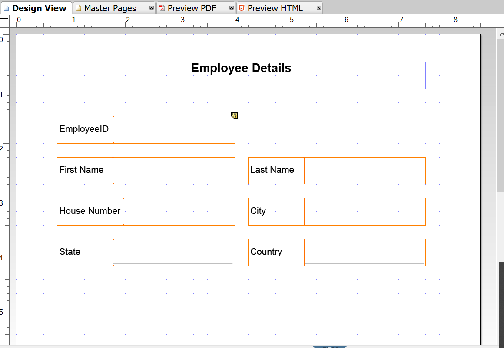
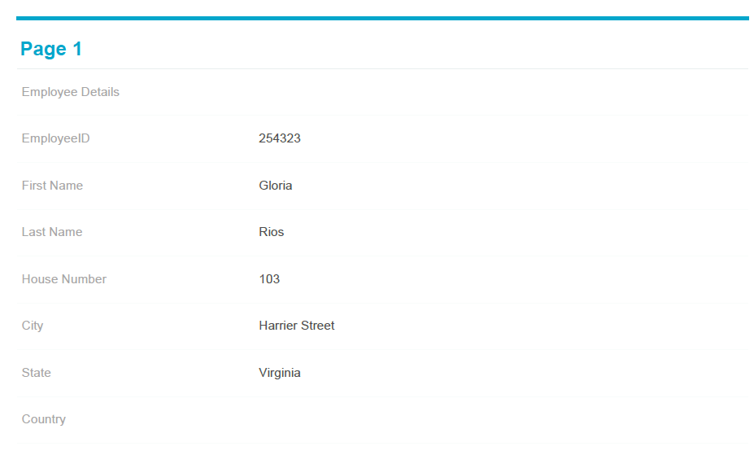
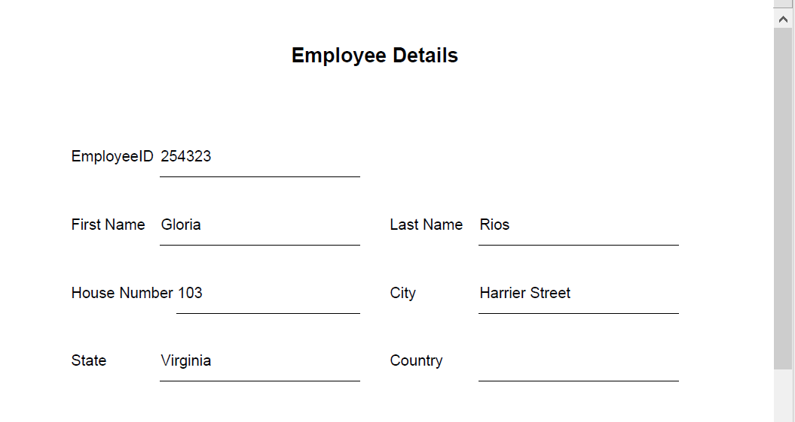
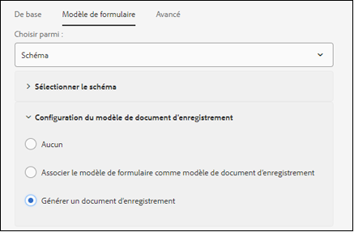
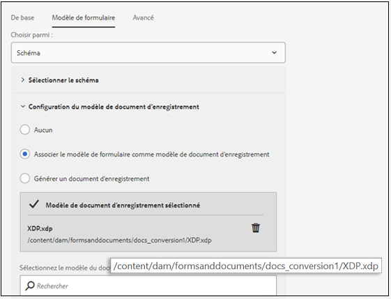

# Workflows recommandés pour activer la génération d’un document d’enregistrement pour les formulaires adaptatifs {#recommended-workflows-dor-generation}

Le document d’enregistrement vous permet de garder une trace des informations que vous fournissez et de les rassembler dans un formulaire adaptatif pour pouvoir vous y référer ultérieurement.
La mise en page du document d’enregistrement suit un modèle de base. Pour générer un document d’enregistrement, vous pouvez soit utiliser un modèle par défaut, soit associer un autre modèle au formulaire adaptatif.

Pour de plus amples informations sur la génération d’un document d’enregistrement, consultez la page [Générer un document d’enregistrement pour les formulaires adaptatifs](https://helpx.adobe.com/fr/experience-manager/6-5/forms/using/generate-document-of-record-for-non-xfa-based-adaptive-forms.html).

Le [service de conversion automatisée de formulaires](/help/using/introduction.md) convertit les formulaires sources suivants en formulaires adaptatifs :

* formulaires PDF non interactifs ;
* formulaires Acro ;
* formulaires PDF basés sur XFA.

Selon le formulaire source utilisé pour la conversion, vous pouvez générer un document d’enregistrement à l’aide des ressources suivantes :

* un modèle par défaut ;
* le formulaire source utilisé en tant que modèle : si vous sélectionnez cette option, le service de conversion associera automatiquement le formulaire source au formulaire adaptatif converti en tant que modèle de document d’enregistrement ;
* tout autre modèle associé au formulaire adaptatif converti.

Le tableau suivant montre l’impact que peut avoir le modèle de document d’enregistrement utilisé sur la mise en page du document d’enregistrement généré :

<table> 
 <tbody>
 <tr>
  <td>
<strong>Formulaire source</strong>
</td>
  <td>
<strong>Document d’enregistrement généré</strong>
</td> 
   </tr>
  <tr>
   <td></td>
   <td>
Si vous utilisez le modèle par défaut pour générer le document d’enregistrement : </td>
   </tr>
   <tr>
   <td></td>
   <td>
Si vous utilisez le formulaire source comme modèle pour générer le document d’enregistrement : 
</td>
   </tr>
  </tbody>
</table>

Comme illustré dans le tableau, si vous utilisez le formulaire source comme modèle, le document d’enregistrement conserve la même mise en page.
Cet article décrit les méthodes recommandées pour générer un document d’enregistrement en fonction des trois types de formulaires sources.

<table> 
 <tbody> 
  <tr> 
   <th><strong>Formulaire source</strong></th> 
   <th><strong>Méthodes de génération de document d’enregistrement</strong></th> 
  </tr> 
  <tr> 
   <td>
Formulaires PDF non interactifs
</td> 
   <td> 
    <ul> 
     <li><a href="#generate-document-of-record-using-cloud-configuration">Activer la génération d’un document d’enregistrement avant la conversion de formulaire adaptatif pour générer un document d’enregistrement à l’aide d’un modèle par défaut</a></li> 
     <li><a href="#edit-adaptive-form-properties-generate-document-of-record">Modifier les propriétés du formulaire adaptatif après la conversion pour activer la génération d’un document d’enregistrement à l’aide du modèle par défaut ou de tout autre modèle de formulaire</a></li> 
    </ul> </td> 
  </tr>
  <tr> 
   <td>
Formulaires Acro ou formulaires PDF basés sur XFA
</td> 
   <td> 
    <ul> 
     <li><a href="#use-input-form-as-template-to-generate-document-of-record">Activer la génération d’un document d’enregistrement avant la conversion de formulaire adaptatif pour générer un document d’enregistrement en utilisant le formulaire source comme modèle</a></li> 
     <li><a href="#edit-adaptive-form-properties-to-generate-document-of-record">Modifier les propriétés du formulaire adaptatif après la conversion pour activer la génération d’un document d’enregistrement à l’aide du modèle par défaut, du formulaire source ou de tout autre modèle de formulaire</a></li> 
    </ul> </td> 
  </tr>    
 </tbody> 
</table>

## Générer un document d’enregistrement pour les formulaires PDF non interactifs {#generate-document-of-record-non-interactive-pdf}

Si vous utilisez un formulaire PDF non interactif comme formulaire source pour le service de conversion automatisée de formulaires, vous pouvez :

* activer la génération d’un document d’enregistrement avant la conversion de formulaire adaptatif pour générer un document d’enregistrement à l’aide d’un modèle par défaut ; ou
* modifier les propriétés du formulaire adaptatif après la conversion pour activer la génération d’un document d’enregistrement à l’aide du modèle par défaut ou de tout autre modèle de formulaire.

### Activer la génération d’un document d’enregistrement avant la conversion pour générer un document d’enregistrement à l’aide d’un modèle par défaut {#generate-document-of-record-using-cloud-configuration}

1. Sélectionnez l’option **[!UICONTROL Tools]** (Outils) > **[!UICONTROL Cloud Services]** (Services cloud) > **[!UICONTROL Automated Forms Conversion Configuration]** (Configuration de la conversion automatisée de formulaires) > Properties of cloud configuration used for conversion (Propriétés de la configuration cloud utilisée pour la conversion) > **[!UICONTROL Advanced]** (Avancé) > **[!UICONTROL Generate Document of Record]** (Générer un document d’enregistrement).

   

1. Appuyez sur **[!UICONTROL Save &amp; Close]** (Enregistrer et fermer) pour enregistrer les paramètres.

1. [Exécutez la conversion](/help/using/convert-existing-forms-to-adaptive-forms.md). Assurez-vous d’utiliser la configuration cloud modifiée à l’étape 1 de ces instructions.
Lors de l’envoi du formulaire adaptatif converti, le document d’enregistrement est automatiquement généré à l’aide du modèle par défaut.

### Modifier les propriétés du formulaire adaptatif après la conversion pour activer la génération du document d’enregistrement {#edit-adaptive-form-properties-generate-document-of-record}

Si vous n’activez pas la génération du document d’enregistrement avant de convertir le formulaire source en un formulaire adaptatif, vous pourrez toujours le faire après la conversion.

1. [Exécutez la conversion](/help/using/convert-existing-forms-to-adaptive-forms.md) sur le formulaire PDF non interactif pour générer un formulaire adaptatif.

1. Sélectionnez le formulaire adaptatif dans le dossier **[!UICONTROL output]** (Sortie) et appuyez sur **[!UICONTROL Properties]** (Propriétés).

1. Dans l’onglet **[!UICONTROL Form Model]** (Modèle de formulaire), développez la section **[!UICONTROL Document of Record Template Configuration]** (Configuration du modèle de document d’enregistrement), puis sélectionnez **[!UICONTROL Generate Document of Record]** (Générer un document d’enregistrement).

   

1. Appuyez sur **[!UICONTROL Save &amp; Close]** (Enregistrer et fermer) pour enregistrer les paramètres.

Lors de l’envoi du formulaire adaptatif converti, le document d’enregistrement est automatiquement généré à l’aide du modèle par défaut. Pour associer un autre modèle de document d’enregistrement au formulaire adaptatif converti, vous pouvez sélectionner l’option **[!UICONTROL Associate form template as the Document of Record template]** (Associer le modèle de formulaire comme modèle de document d’enregistrement).

## Générer un document d’enregistrement pour les formulaires Acro ou les formulaires PDF basés sur XFA {#generate-document-of-record-acroform-xfaform}

Si vous utilisez un formulaire Acro ou un formulaire PDF basé sur XFA comme formulaire source pour le service de conversion automatisée de formulaires, vous pouvez :

* activer la génération d’un document d’enregistrement avant la conversion de formulaire adaptatif pour générer un document d’enregistrement en utilisant le formulaire source comme modèle ; ou

* modifier les propriétés du formulaire adaptatif après la conversion pour activer la génération d’un document d’enregistrement à l’aide du modèle par défaut, du formulaire source ou de tout autre modèle de formulaire.

### Activer la génération d’un document d’enregistrement avant la conversion pour générer un document d’enregistrement en utilisant le formulaire source comme modèle {#use-input-form-as-template-to-generate-document-of-record}

1. Sélectionnez l’option **[!UICONTROL Tools]** (Outils) > **[!UICONTROL Cloud Services]** (Services cloud) > **[!UICONTROL Automated Forms Conversion Configuration]** (Configuration de la conversion automatisée de formulaires) > Properties of cloud configuration used for conversion (Propriétés de la configuration cloud utilisée pour la conversion) > **[!UICONTROL Advanced]** (Avancé) > **[!UICONTROL Generate Document of Record]** (Générer un document d’enregistrement).

1. Appuyez sur **[!UICONTROL Save &amp; Close]** (Enregistrer et fermer) pour enregistrer les paramètres.

1. [Exécutez la conversion](/help/using/convert-existing-forms-to-adaptive-forms.md). Assurez-vous d’utiliser la configuration cloud modifiée à l’étape 1 de ces instructions.
Le service de conversion associe automatiquement le formulaire Acro ou le formulaire PDF basé sur XFA au formulaire adaptatif converti en tant que modèle de document d’enregistrement.
Vous pouvez ouvrir les propriétés du formulaire adaptatif pour afficher le modèle de document d’enregistrement dans la section **[!UICONTROL Document of Record Template Configuration]** (Configuration du modèle de document d’enregistrement) de l’onglet **[!UICONTROL Form Model]** (Modèle de formulaire).

   

   Lors de l’envoi du formulaire adaptatif converti, le document d’enregistrement est automatiquement généré en utilisant le formulaire source comme modèle.

### Modifier les propriétés du formulaire adaptatif après la conversion pour activer la génération du document d’enregistrement {#edit-adaptive-form-properties-to-generate-document-of-record}

1. [Exécutez la conversion](/help/using/convert-existing-forms-to-adaptive-forms.md) sur le formulaire PDF non interactif pour générer un formulaire adaptatif.

1. Sélectionnez le formulaire adaptatif dans le dossier **[!UICONTROL output]** (sortie) et appuyez sur **[!UICONTROL Properties]** (Propriétés).

1. Dans l’onglet **[!UICONTROL Form Model]** (Modèle de formulaire), développez la section **[!UICONTROL Document of Record Template Configuration]** (Configuration du modèle de document d’enregistrement), puis sélectionnez **[!UICONTROL Generate Document of Record]** (Générer un document d’enregistrement) afin d’activer la génération du document d’enregistrement à l’aide du modèle par défaut.
Vous pouvez également sélectionner l’option **[!UICONTROL Associate form template as the Document of Record template]** (Associer le modèle de formulaire comme modèle de document d’enregistrement) ainsi que le modèle pour activer la génération du document d’enregistrement à l’aide du formulaire source ou de tout autre modèle de formulaire.

1. Appuyez sur **[!UICONTROL Save &amp; Close]** (Enregistrer et fermer) pour enregistrer les paramètres.
