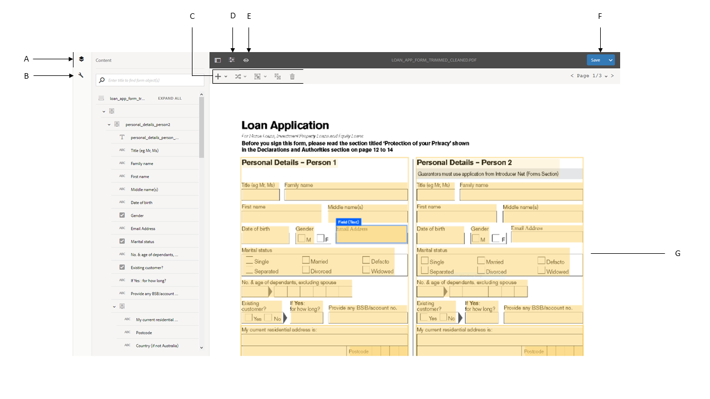
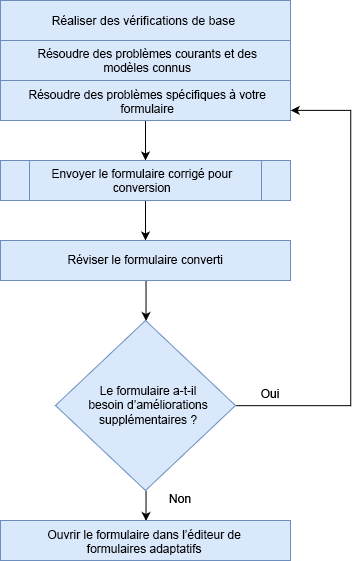

# Vérifier et corriger les formulaires convertis{#review-and-correct-converted-forms}

Le service de conversion automatisée de formulaires AEM Forms identifie les champs, le contenu et la mise en page du document PDF d’entrée et convertit le document PDF en un formulaire adaptatif. Le formulaire adaptatif de sortie peut avoir quelques champs manquants ou mal convertis. Vous pouvez utiliser l’éditeur de vérification et de correction pour améliorer les champs identifiés et générer à nouveau le formulaire adaptatif pour vous rapprocher du résultat escompté. Après la première conversion, vous pouvez ouvrir le document PDF d’entrée dans l’éditeur pour :

* Afficher tous les champs et contenus identifiés lors de la conversion
* Identifier les champs et le contenu non pris en compte lors de la conversion
* Vérifier le type d’un champ et le modifier, le cas échéant
* Vérifier les tableaux identifiés, redimensionner les colonnes et modifier le contenu des cellules
* Supprimer les champs mal identifiés

Après avoir apporté les modifications requises, renvoyez les formulaires PDF au service de conversion. En cas de conversion réussie, les actifs mis à jour, y compris le formulaire adaptatif et le schéma, sont téléchargés sur votre instance AEM Forms. Vous pouvez répéter l’opération jusqu’à obtenir le résultat souhaité. 

Vous avez besoin de Google Chrome, Mozilla FireFox ou Microsoft Edge pour utiliser l’éditeur de vérification et de correction. L’éditeur ne prend pas en charge Internet Explorer.

## Bienvenue dans l’éditeur de vérification et de correction {#welcome-to-review-and-correct-editor}

L’éditeur de vérification et de correction dispose d’une interface conviviale. Elle inclut les fonctionnalités suivantes :

* Explorateur de contenu : vous pouvez utiliser l’explorateur de contenu pour déplacer un élément grâce à la fonctionnalité glisser-déposer. Vous pouvez par exemple déplacer un tableau avant une zone de texte. L’ordre de tabulation du formulaire adaptatif de sortie est alors modifié.
* Explorateur de propriétés : il affiche les propriétés d’un champ sélectionné. Vous pouvez également modifier les propriétés.
* Barre d’outils : la barre d’outils se trouve en haut de l’éditeur. Elle inclut des outils d’ajout, de modification, de fusion, de dissociation et de suppression des champs.
* Ouvrir les propriétés : l’option permettant d’ouvrir les propriétés apparaît lorsque vous appuyez sur l’icône . Vous pouvez cliquer dessus pour ouvrir les propriétés du formulaire et afficher des options supplémentaires.
* Bouton de filtrage : le bouton de filtrage  se trouve en haut de l’éditeur. Il vous permet de filtrer les champs pour afficher uniquement certains textes, champs, groupes de choix ou panneaux ou bien tous les composants.
* Bouton Save (Enregistrer) : le bouton **[!UICONTROL Save]** (Enregistrer) se trouve dans le coin supérieur droit de l’éditeur. Vous pouvez également utiliser la flèche en regard du bouton Save (Enregistrer) pour afficher l’option de conversion du formulaire.

* Formulaire PDF : l’éditeur affiche le document PDF source et y incruste les champs identifiés. Vous pouvez utiliser les outils de la barre d’outils pour modifier les champs.
* Pages : un formulaire source peut comporter plusieurs pages. Un bouton est disponible dans le coin supérieur droit de l’éditeur pour naviguer entre les pages.

**A.** Explorateur de contenu **B.** Explorateur de propriétés **C.** Barre d’outils **D.** Bouton Propriétés **E.** Bouton de filtrage **F.** Bouton Save (Enregistrer) **G.** Formulaire PDF sur lequel ont été incrustés les champs identifiés

Une fois la première conversion effectuée, le service de conversion incruste les champs et composants identifiés dans le document PDF source. Ces champs ou composants sont de type texte, champ, panneau, groupe de choix et tableau :

* Texte : texte brut dans le document PDF source. Par exemple, le texte de la demande de prêt dans l’image ci-dessus.
* Champ : libellé d’icône ou de texte associé à une zone Valeur ou de saisie. Par exemple, le nom du premier champ dans l’image ci-dessus. Il comporte un libellé de texte et une zone de saisie. Un champ prend en charge les types de données suivants : texte, données numériques, liste déroulante, date, courrier électronique, numéro de téléphone, signature, devise et mot de passe.
* Panneau : collection logique de contenu et de composants. Par exemple, les données personnelles des panneaux Person 1 (Personne 1) et Person 2 (Personne 2) dans l’image ci-dessus.
* Groupe de choix : texte associé à des options à choix multiples : case à cocher et bouton radio. Par exemple, l’état civil et le client existant dans l’image ci-dessus.\
  En fonction de la légende du groupe de choix et de ses options à choix multiples, le service de conversion convertit automatiquement un groupe de choix en un bouton radio à sélection unique ou en une case à cocher à sélections multiples. Par exemple, si la légende du groupe de choix indique **Sélectionnez l’option appropriée** ou que les options à choix multiples ne vous permettent de sélectionner qu’une seule option, **Oui** ou **Non**, le service de conversion convertit automatiquement le groupe de choix en un bouton radio à sélection unique. De même, si la légende du groupe de choix indique **Sélectionnez toutes les options applicables** ou **Sélectionnez plusieurs options** ou que les options à choix multiples vous permettent de sélectionner plusieurs options, le service de conversion convertit automatiquement le groupe de choix en une case à cocher à sélections multiples.

* Tableau : tableau en 2D contenant des informations représentées sous forme de colonnes et de lignes. Vous pouvez ajouter ou supprimer des lignes ou des colonnes dans un tableau.

## Commencer à vérifier une conversion {#start-reviewing-a-conversion}

Une fois la première conversion effectuée, le service de conversion incruste les champs et composants identifiés dans le document PDF source. Vous pouvez améliorer les champs identifiés et générer à nouveau le formulaire adaptatif pour vous rapprocher du résultat escompté. Vous ne pouvez commencer à vérifier une conversion qu’une fois la première conversion effectuée.

### Avant de commencer {#before-you-start}

* L’éditeur de vérification et de correction ne prend pas en charge les fragments. N’utilisez pas l’éditeur pour examiner les conversions pour lesquelles l’option **Extract Fragment** (Extraire les fragments) était activée au cours des conversions. Vous pouvez utiliser l’[éditeur de formulaire adaptatif](https://helpx.adobe.com/fr/experience-manager/6-5/forms/using/introduction-forms-authoring.html) pour de telles conversions.

* Il est impossible d’annuler une action dans l’éditeur de vérification et de correction. Ne cliquez sur le bouton Save (Enregistrer) que pour enregistrer définitivement les modifications.

### Démarrer la vérification {#start-the-review}

Pour commencer à vérifier les conversions, sélectionnez le document PDF source utilisé pour la conversion, puis sélectionnez et appuyez sur **Review Conversions** (Vérifier les conversions). L’éditeur de vérification et de correction s’ouvre dans un nouvel onglet. Vous pouvez commencer à vérifier les conversions. Effectuez les vérifications de base suivantes avant de commencer à résoudre tout autre problème :

1. **Vérifiez le type de tous les champs** : le service de conversion peut parfois attribuer un type incorrect à un champ. Par exemple, le champ « téléphone mobile » s’est vu attribuer le type « texte » au lieu du type « téléphone ». Vous pouvez survoler un champ pour en connaître le type.

   Pour modifier le type d’un champ, sélectionnez-le, ouvrez l’explorateur de propriétés, sélectionnez une valeur dans la liste déroulante **[!UICONTROL Type]**, puis appuyez sur **[!UICONTROL Save]** (Enregistrer). Le type sera alors modifié.

   

1. **Supprimez les panneaux supplémentaires** : le service de conversion peut générer des panneaux supplémentaires. Par exemple, un sous-panneau supplémentaire est inclus dans le panneau parent, un espace vide est converti en panneau, une case à cocher est convertie en panneau. Examinez les bordures de tous les panneaux et supprimez les panneaux supplémentaires. Vous pouvez utiliser le bouton de filtrage  ou l’explorateur de contenu pour afficher tous les panneaux.

   Vous pouvez supprimer ou dissocier un panneau pour le retirer. Si vous utilisez l’option de suppression, les composants ou champs enfants du panneau sont également supprimés :

   * Pour supprimer un panneau, sélectionnez-le, puis appuyez sur l’icône de suppression  dans la barre d’outils. Dans la boîte de dialogue de confirmation, appuyez sur **[!UICONTROL Confirm]** (Confirmer). Appuyez sur **[!UICONTROL Save]** (Enregistrer) pour enregistrer les modifications.

   * Pour dissocier un panneau, sélectionnez-le, puis appuyez sur l’icône de dissociation dans la barre d’outils. Le panneau est dissocié et les champs enfants du panneau dissocié sont ajustés au champ parent. Appuyez sur **[!UICONTROL Save]** (Enregistrer) pour enregistrer les modifications.

1. **Créez des groupes logiques de texte** : confirmez l’exhaustivité et l’exactitude des textes identifiés. Vérifiez également que les textes sont placés de manière logique dans des panneaux ou des groupes corrects. Par exemple, dans une mise en page à plusieurs colonnes, les textes d’un groupe logique sont placés dans un groupe distinct.

   * Pour vérifier l’exhaustivité et l’exactitude du texte, utilisez le bouton de filtrage  pour afficher uniquement le texte, cliquez sur chaque texte et validez. Corrigez les éventuelles fautes d’orthographe, de frappe ou de grammaire.

   * Pour ajouter du texte au formulaire, appuyez sur le bouton +, puis sur **[!UICONTROL Text]** (Texte). Dessinez la zone de texte, ouvrez l’explorateur de propriétés et saisissez le texte à ajouter au champ Contenu.

1. **Vérifiez les tableaux :** assurez-vous que toutes les bordures du tableau sont identifiées. Vérifiez également que le contenu des cellules est correctement identifié.

   * Pour identifier les bordures manquantes, utilisez l’option **[!UICONTROL Add Column]** (Ajouter une colonne) ou **[!UICONTROL Add Row]** (Ajouter une ligne).

   * Pour supprimer les bordures supplémentaires, utilisez l’option **[!UICONTROL Delete Column]** (Supprimer la colonne) ou **[!UICONTROL Delete Row]** (Supprimer la ligne).

Après avoir apporté les modifications requises, appuyez sur le bouton **[!UICONTROL Save &amp; Convert]** (Enregistrer et convertir) pour renvoyer les formulaires PDF au service de conversion. Chaque champ est converti en un composant de champ adaptatif correspondant. Après la conversion, les actifs mis à jour, y compris le formulaire adaptatif et le schéma, sont téléchargés sur votre instance AEM Forms. Selon la complexité du formulaire, la conversion peut prendre un certain temps.

Après avoir effectué les vérifications de base, vous pouvez vérifier le formulaire afin de résoudre les problèmes spécifiques à votre entreprise. Ces problèmes peuvent notamment être liés à l’ajout de champs manquants. Vous pouvez consulter la section [Utiliser les outils de l’éditeur de vérification et de correction](review-correct-ui-edited.md#use-the-review-and-correct-editor-tools) pour découvrir tous les outils que propose l’éditeur pour résoudre ce type de problèmes.

Vous pouvez également apprendre à reconnaître les problèmes récurrents et les signaler à Adobe. Utilisez l’éditeur de vérification et de correction jusqu’à obtenir le résultat escompté.

## Utiliser les outils de l’éditeur de vérification et de correction {#use-the-review-and-correct-editor-tools}

Avec l’éditeur de vérification et de correction, vous pouvez :

* [Ajouter un composant au formulaire](review-correct-ui-edited.md#add-a-component-to-the-form)
* [Ajouter ou modifier un tableau](review-correct-ui-edited.md)
* [Modifier le type d’un composant](review-correct-ui-edited.md#change-type-a-component)

* [Créer ou supprimer un panneau](review-correct-ui-edited.md#create-or-remove-a-panel)
* [Supprimer un panneau ou un composant](review-correct-ui-edited.md#delete-a-panel-or-component)
* [Définir les propriétés d’un composant](review-correct-ui-edited.md#set-properties-of-a-component)
* [Envoyer un formulaire pour conversion](review-correct-ui-edited.md#send-a-form-for-conversion)

### Ajouter un composant au formulaire {#add-a-component-to-the-form}

Le service de conversion peut ne pas identifier certains composants du formulaire imprimé. Par exemple, le composant **Date of birth** (Date de naissance) d’un formulaire n’est pas identifié lors de la conversion. Vous pouvez utiliser l’outil **+** pour aider à identifier ces composants. L’outil vous permet d’ajouter du texte, un champ, un groupe de choix, un tableau et des composants de panneau.

Pour ajouter un composant au formulaire, appuyez sur **[!UICONTROL +]**, puis sur **[!UICONTROL Field]** (Champ). Dessinez une zone de texte recouvrant le libellé et la zone de saisie du champ. Par exemple, dans l’image fournie à titre d’exemple ci-dessus, le composant Field (Champ) est utilisé pour ajouter au formulaire le libellé **Date of birth** (Date de naissance) et le champ Valeur situé dessous. Lorsque vous dessinez la zone de texte, le service de conversion identifie le type de champ. Si nécessaire, vous pouvez modifier le type de champ depuis l’explorateur de propriétés. Après avoir créé le composant, ouvrez l’explorateur de propriétés et définissez les propriétés du composant.

Appuyez sur le bouton **[!UICONTROL Save]** (Enregistrer) pour enregistrer les modifications ou sur **[!UICONTROL Save &amp; Convert]** (Enregistrer et convertir) pour renvoyer les formulaires PDF au service de conversion.

### Ajouter ou modifier un tableau {#addedittable}

La conversion peut ne pas identifier certaines cellules, bordures ou données d’une cellule de tableau. Par exemple, une ligne d’un tableau n’est pas identifiée. Vous pouvez utiliser l’éditeur de vérification et de correction pour identifier ces éléments. Vous pouvez effectuer les actions suivantes dans un tableau :

* Pour sélectionner un tableau, cliquez sur n’importe quelle cellule du tableau.
* Cliquez deux fois sur une cellule pour en modifier les propriétés (nom, titre, type, etc.). Vous pouvez également cliquer deux fois sur la cellule pour en modifier le contenu, marquer un champ requis et sélectionner d’autres propriétés.
* Pour ajouter un nouveau tableau ou identifier un tableau non identifié dans le formulaire, utilisez l’outil **[!UICONTROL +]**.
* Pour redimensionner les cellules ou les lignes d’un tableau, cliquez dans une zone vide du tableau, survolez la bordure de la ligne ou de la colonne et cliquez dessus pour la déplacer lorsque le pointeur du curseur change. Après le redimensionnement, cliquez sur **[!UICONTROL Done]** (Terminé) pour valider les modifications. Pour annuler les modifications, appuyez sur la touche **[!UICONTROL Échap]**.

* Pour ajouter ou supprimer des lignes ou des colonnes, sélectionnez une cellule dans la ligne du tableau, puis sélectionnez l’option **[!UICONTROL Add Row]** (Ajouter une ligne), **[!UICONTROL Add Column]** (Ajouter une colonne), **[!UICONTROL Delete Row]** (Supprimer une ligne) ou **[!UICONTROL Delete Column]** (Supprimer une colonne) dans le menu .

* Pour fractionner une cellule d’un tableau, sélectionnez l’option **[!UICONTROL Split Vertical]** (Fractionner verticalement) ou **[!UICONTROL Split Horizontal]** (Fractionner horizontalement) dans le menu .

* Pour fusionner plusieurs cellules d’un tableau, sélectionnez les cellules à fusionner, puis l’option **[!UICONTROL Merge Cells]** (Fusionner les cellules) dans le menu .

### Modifier le type d’un composant {#change-type-a-component}

Le service de conversion peut créer des types de champs incorrects. Par exemple, dans l’image suivante, le champ **Gender** (Sexe) est identifié à tort comme un champ **Text** (Texte). Le contenu du libellé est également incorrect. Le champ devrait être un champ de choix et le libellé devrait être Gender (Sexe). Pour changer le type d’un composant et corriger son libellé :

Sélectionnez le champ à convertir, appuyez sur , puis sur un type de champ. Le type de champ sélectionné sera alors appliqué au champ concerné. La conversion s’applique uniquement aux types de champs répertoriés dans le tableau suivant : Un composant de panneau peut uniquement être dissocié, et non transformé.

| **Composant** | **Est converti en** |
|---|---|
| Text (Texte) | Champ ou groupe de choix |
| Field (Champ) | Texte ou groupe de choix |
| Choice Group (Groupe de choix) | Texte ou panneau |

Une fois la conversion effectuée, ouvrez l’explorateur de propriétés, indiquez le libellé et spécifiez les autres propriétés requises. Appuyez sur le bouton **[!UICONTROL Save]** (Enregistrer) pour enregistrer les modifications ou sur Save &amp; Convert (Enregistrer et convertir) pour renvoyer les formulaires PDF au service de conversion.

### Créer ou supprimer un panneau {#create-or-remove-a-panel}

Le service de conversion regroupe les composants associés et le contenu des formulaires imprimés dans un panneau. Par exemple, le formulaire peut inclure un panneau d’adresse avec les champs suivants : nom, numéro de rue, région, ville, état, code postal et pays. Ces champs sont regroupés dans un panneau. Un formulaire peut contenir plusieurs panneaux.

Le service de conversion peut créer des panneaux dont les composants n’ont aucun rapport les uns avec les autres ou exclure un composant relatif du panneau. Vous pouvez utiliser les outils de fusion ou de dissociation pour corriger ces panneaux :

* Pour supprimer un panneau, sélectionnez-le et appuyez sur Ungroup (Dissocier) . Le panneau est supprimé et les composants enfants du panneau sont déplacés vers le composant parent. Vous pouvez également utiliser l’option de [suppression du composant](review-correct-ui-edited.md#delete-a-panel-or-component) pour supprimer un panneau et ses composants enfants.

* Pour créer un panneau, utilisez la touche Ctrl (sous Windows ou Linux) ou la touche Contrôle (sous Mac) pour sélectionner les composants associés, puis appuyez sur  pour créer un panneau. Ouvrez l’explorateur de propriétés pour spécifier les propriétés du panneau.

Appuyez sur le bouton **[!UICONTROL Save]** (Enregistrer) pour enregistrer les modifications ou sur **[!UICONTROL Save &amp; Convert]** (Enregistrer et convertir) pour renvoyer les formulaires PDF au service de conversion.

### Supprimer un panneau ou un composant {#delete-a-panel-or-component}

Le service de conversion peut identifier certains panneaux ou composants incorrects. La plupart des composants de ces panneaux ne sont pas liés. Vous pouvez supprimer ces panneaux ou composants.

Pour supprimer un panneau ou un composant, sélectionnez-le, puis appuyez sur l’icône de suppression . Dans la boîte de dialogue de confirmation, appuyez sur **[!UICONTROL Confirm]** (Confirmer). Le panneau ou le composant sélectionné est alors supprimé. Lors de la suppression d’un panneau, tous les composants enfants du panneau sont également supprimés. Vous pouvez utiliser la touche Ctrl (sous Windows ou Linux) ou la touche Contrôle (sous Mac) pour sélectionner plusieurs composants ou panneaux.

### Définir les propriétés d’un composant {#set-properties-of-a-component}

Chaque composant du formulaire comporte un ensemble de propriétés, telles que le nom, le titre et le type. Pour définir les propriétés d’un composant, sélectionnez-le et appuyez sur l’explorateur de propriétés. Les propriétés du composant sélectionné s’affichent. Modifiez ou définissez les propriétés.

Appuyez sur le bouton **[!UICONTROL Save]** (Enregistrer) pour enregistrer les modifications ou sur **[!UICONTROL Save &amp; Convert]** (Enregistrer et convertir) pour renvoyer les formulaires PDF au service de conversion.

### Envoyer un formulaire pour conversion {#send-a-form-for-conversion}

Après avoir apporté toutes les modifications requises dans l’éditeur de vérification et de correction, vous pouvez convertir à nouveau le formulaire. Pour convertir le formulaire, appuyez sur **[!UICONTROL Save &amp; Convert]** (Enregistrer et convertir). Le libellé **[!UICONTROL Sent for conversion]** (Envoyé pour conversion) est ajouté au dossier contenant le document source et le formulaire source mis à jour est téléchargé vers le service de conversion exécuté sur Adobe I/O.

Selon la complexité du formulaire, la conversion peut prendre un certain temps. Une fois la conversion terminée, le formulaire adaptatif converti et les ressources associées sont téléchargés sur votre ordinateur. Vous pouvez ensuite vérifier le formulaire dans l’éditeur et l’ouvrir dans l’[éditeur de formulaire adaptatif](https://helpx.adobe.com/fr/experience-manager/6-5/forms/using/introduction-forms-authoring.html) pour apporter les dernières modifications nécessaires.

Si vous renvoyez un formulaire pour conversion après l’avoir mis à jour dans l’éditeur de formulaire adaptatif, toutes les modifications apportées au formulaire adaptatif seront perdues. Vous ne pouvez ouvrir un formulaire dans l’éditeur de vérification et de correction qu’après avoir effectué la conversion.

<!--
Comment Type: draft

<h3>Open adaptive forms editor</h3>
-->

<!--
Comment Type: draft

There can be instances where you require adaptive forms editor to make the changes like, applying a different theme to the form or fixing tables. Once you have made all the required changes in Review and Correct editor and converted the form, you can open your form in adaptive forms editor to make the final set of changes.

To open the form with adaptive forms editor, tap the  icon, and tap <strong>Open Adaptive Form Editor</strong>. The form opens in adaptive form editor. 

## Previous {#previous}

[Use Automated Forms Conversion service](convert-existing-forms-to-adaptive-forms.md)
-->
