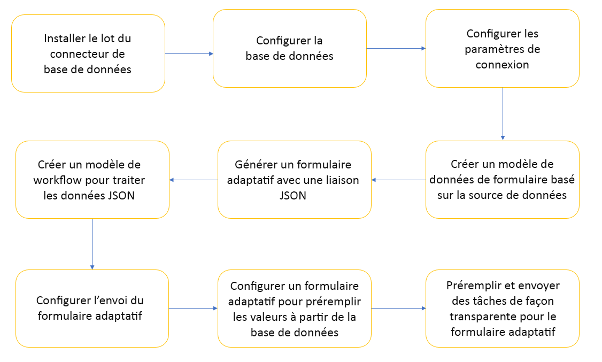

# Intégrer un formulaire adaptatif à une base de données à l’aide d’un workflow AEM {#submit-forms-to-database-using-forms-portal}

Le service de conversion automatisée de formulaires vous permet de convertir un formulaire PDF non interactif, un formulaire Acro ou un formulaire PDF basé sur XFA en un formulaire adaptatif. Lors du lancement du processus de conversion, vous avez la possibilité de générer un formulaire adaptatif avec ou sans liaison de données.

Si vous choisissez de générer un formulaire adaptatif sans liaison de données, vous pouvez incorporer le formulaire adaptatif converti à un modèle de données de formulaire, un schéma XML ou un schéma JSON après la conversion. Pour le modèle de données de formulaire, vous devez lier manuellement les champs de formulaires adaptatifs au modèle de données de formulaire. Toutefois, si vous générez un formulaire adaptatif avec des liaisons de données, le service de conversion associe automatiquement le ou les formulaires adaptatifs à un schéma JSON et crée une liaison de données entre les champs disponibles dans le formulaire adaptatif et le schéma JSON. Vous pouvez ensuite intégrer le formulaire adaptatif à une base de données de votre choix, remplir les données du formulaire et les envoyer à la base de données. De même, après une intégration réussie à la base de données, vous pouvez configurer les champs du formulaire adaptatif converti pour récupérer les valeurs de la base de données et préremplir les champs du formulaire adaptatif.

Le schéma suivant illustre différentes étapes de l’intégration d’un formulaire adaptatif converti à une base de données :



Cet article décrit les instructions détaillées pour réussir à exécuter toutes ces étapes d’intégration.

## Prérequis {#pre-requisites}

* Configuration d’une instance d’auteur AEM 6.4 ou 6.5
* Installation du [dernier Service Pack](https://helpx.adobe.com/fr/experience-manager/aem-releases-updates.html) pour votre instance AEM
* Dernière version du package de module complémentaire AEM Forms
* Configuration du [service de conversion automatisée de formulaires](configure-service.md)
* Configuration d’une base de données. La base de données utilisée dans l’exemple d’implémentation est MySQL 5.6.24. Cependant, vous pouvez intégrer le formulaire adaptatif converti à n’importe quelle base de données de votre choix.

## Exemple de formulaire adaptatif {#sample-adaptive-form}

Pour mettre en pratique le cas d’utilisation afin d’intégrer des formulaires adaptatifs convertis à une base de données à l’aide d’un processus AEM, téléchargez l’exemple de fichier PDF suivant.

Pour télécharger l’exemple de formulaire de contact, cliquez sur le lien suivant :

[Obtenir le fichier](assets/sample_contact_us_form.pdf)

Le fichier PDF sert d’entrée au service de conversion automatisée de formulaires. Le service convertit ce fichier en un formulaire adaptatif. L’image suivante montre un exemple de formulaire de contact au format PDF.


## Installer le fichier mysql-connector-java-5.1.39-bin.jar {#install-mysql-connector-java-file}

Effectuez les étapes suivantes, sur toutes les instances d’auteur et de publication, pour installer le fichier mysql-connector-java-5.1.39-bin.jar :

1. Accédez à `http://server:port/system/console/depfinder` et recherchez le package com.mysql.jdbc.
1. Dans la colonne Exported by (Exporté par), vérifiez si le package est exporté par un groupe. Continuez si le package n’est pas exporté par un groupe.
1. Accédez à `http://server:port/system/console/bundles` et cliquez sur **[!UICONTROL Install/Update]** (Installer/Mettre à jour).
1. Cliquez sur **[!UICONTROL Choose File]** (Choisir un fichier) et accédez au chemin permettant de sélectionner le fichier mysql-connector-java-5.1.39-bin.jar. Cochez également les cases **[!UICONTROL Start Bundle]** (Démarrer le groupe) et **[!UICONTROL Refresh Packages]** (Actualiser les packages).
1. Cliquez sur **[!UICONTROL Install]** (Installer) ou **[!UICONTROL Update]** (Mettre à jour). Une fois cette opération effectuée, redémarrez le serveur.
1. (Windows uniquement) Désactivez le pare-feu système pour votre système d’exploitation.

## Préparer les données pour le modèle de formulaire {#prepare-data-for-form-model}

L’intégration de données AEM Forms permet de configurer des sources de données disparates et de s’y connecter. Après avoir généré un formulaire adaptatif à l’aide du processus de conversion, vous pouvez définir le modèle de formulaire en fonction d’un modèle de données de formulaire, XSD, ou d’un schéma JSON. Vous pouvez utiliser une base de données, Microsoft Dynamics, ou tout autre service tiers pour créer un modèle de données de formulaire.

Ce tutoriel utilise la base de données MySQL comme source pour créer un modèle de données de formulaire. Créez un schéma dans la base de données et ajoutez-y un tableau **contactus** en fonction des champs disponibles dans le formulaire adaptatif.


Vous pouvez utiliser l’instruction DDL suivante pour créer le tableau **contactus** dans la base de données.

```sql
CREATE TABLE `contactus` (
   `name` varchar(45) NOT NULL,
   `email` varchar(45) NOT NULL,
   `phonenumber` varchar(10) DEFAULT NULL,
   `issuedesc` varchar(1000) DEFAULT NULL,
   PRIMARY KEY (`email`)
 ) ENGINE=InnoDB DEFAULT CHARSET=utf8
```

## Configurer la connexion entre l’instance AEM et la base de données {#configure-connection-between-aem-instance-and-database}

Procédez aux étapes de configuration suivantes pour créer une connexion entre l’instance AEM et la base de données MYSQL :

1. Accédez à la page de configuration de la console Web AEM à l’adresse `http://server:port/system/console/configMgr`.
1. Recherchez **[!UICONTROL Apache Sling Connection Pooled DataSource]** et cliquez dessus pour l’ouvrir en mode d’édition dans la configuration de la console Web. Spécifiez les valeurs des propriétés comme décrit dans le tableau suivant :

   <table> 
    <tbody> 
    <tr> 
    <th><strong>Propriétés</strong></th> 
    <th><strong>Valeur</strong></th> 
    </tr> 
    <tr> 
    <td><p>Nom de la source de données</p></td> 
    <td><p>Un nom de source de données pour filtrer les pilotes du pool de la source de données.</p></td>
    </tr>
    <tr> 
    <td><p>Classe de pilote JDBC</p></td> 
    <td><p>com.mysql.jdbc.Driver</p></td>
    </tr>
    <tr> 
    <td><p>URI de connexion JDBC</p></td> 
    <td><p>jdbc:mysql://[host]:[port]/[schema_name]</p></td>
    </tr>
    <tr> 
    <td><p>Nom d’utilisateur</p></td> 
    <td><p>Nom d’utilisateur pour l’authentification et l’exécution d’actions sur les tables de base de données</p></td>
    </tr>
    <tr> 
    <td><p>Mot de passe</p></td> 
    <td><p>Mot de passe associé au nom d’utilisateur</p></td>
    </tr>
    <tr> 
    <td><p>Isolation des transactions</p></td> 
    <td><p>READ_COMMITTED</p></td>
    </tr>
    <tr> 
    <td><p>Nombre max. de connexions actives</p></td> 
    <td><p>1 000</p></td>
    </tr>
    <tr> 
    <td><p>Nombre max. de connexions inactives</p></td> 
    <td><p>100</p></td>
    </tr>
    <tr> 
    <td><p>Nombre min. de connexions inactives</p></td> 
    <td><p>10</p></td>
    </tr>
    <tr> 
    <td><p>Taille initiale</p></td> 
    <td><p>10</p></td>
    </tr>
    <tr> 
    <td><p>Attente max.</p></td> 
    <td><p>100 000</p></td>
    </tr>
     <tr> 
    <td><p>Test lors de l’emprunt</p></td> 
    <td><p>Cochée</p></td>
    </tr>
     <tr> 
    <td><p>Test en mode inactif</p></td> 
    <td><p>Cochée</p></td>
    </tr>
     <tr> 
    <td><p>Requête de validation</p></td> 
    <td><p>Exemples de valeurs : SELECT 1(mysql), select 1 from dual (oracle), SELECT 1 (MS Sql Server) (validationQuery).</p></td>
    </tr>
     <tr> 
    <td><p>Délai d’expiration des requêtes de validation</p></td> 
    <td><p>10 000</p></td>
    </tr>
    </tbody> 
    </table>

## Créer un modèle de données de formulaire {#create-form-data-model}

Après avoir configuré MYSQL comme source de données, exécutez les étapes suivantes pour créer un modèle de données de formulaire :

1. Dans l’instance d’auteur AEM, accédez à **[!UICONTROL Forms]** (Formulaires) > **[!UICONTROL Data Integrations]** (Intégrations de données).

1. Appuyez sur **[!UICONTROL Create]** (Créer) > **[!UICONTROL Form Data Model]** (Modèle de données de formulaire).

1. Dans l’assistant **[!UICONTROL Create Form Data Model]** (Créer un modèle de données de formulaire), nommez le modèle de données de formulaire **workflow_submit**. Appuyez sur **[!UICONTROL Next]** (Suivant).

1. Sélectionnez la source de données MYSQL configurée dans la section précédente et appuyez sur **[!UICONTROL Create]** (Créer).

1. Appuyez sur **[!UICONTROL Edit]** (Modifier) et développez la source de données répertoriée dans le volet de gauche pour sélectionner le tableau **contactus** ainsi que les services **[!UICONTROL get]** et **[!UICONTROL insert]**, puis appuyez sur **[!UICONTROL Add Selected]** (Ajouter la sélection).

   

1. Sélectionnez l’objet de modèle de données dans le volet de droite et appuyez sur **[!UICONTROL Edit Properties]** (Modifier les propriétés). Sélectionnez **[!UICONTROL get]** et **[!UICONTROL insert]** dans les listes déroulantes **[!UICONTROL Read Service]** (Service de lecture) et **[!UICONTROL Write Service]** (Service d’écriture). Spécifiez les arguments du service de lecture et appuyez sur **[!UICONTROL Done]** (Terminé).

1. Dans l’onglet **[!UICONTROL Services]**, sélectionnez le service **[!UICONTROL get]** et appuyez sur **[!UICONTROL Edit Properties]** (Modifier les propriétés). Sélectionnez **[!UICONTROL Output Model Object]** (Objet de modèle de sortie), désactivez le bouton bascule **[!UICONTROL Return array]** (Revenir au tableau) et appuyez sur **[!UICONTROL Done]** (Terminé).

1. Sélectionnez le service **[!UICONTROL Insert]** (Insérer) et appuyez sur **[!UICONTROL Edit Properties]** (Modifier les propriétés). Sélectionnez **[!UICONTROL Input Model Object]** (Objet de modèle d’entrée) et appuyez sur **[!UICONTROL Done]** (Terminé).

1. Appuyez sur **[!UICONTROL Save]** (Enregistrer) pour enregistrer le modèle de données de formulaire.

Pour télécharger l’exemple de modèle de données de formulaire, cliquez sur le lien suivant :

[Obtenir le fichier](assets/DownloadedFormsPackage_1497728018502500.zip)

## Générer des formulaires adaptatifs avec la liaison JSON {#generate-adaptive-forms-with-json-binding}

Utilisez le [service de conversion automatisée de formulaires pour convertir](convert-existing-forms-to-adaptive-forms.md) le [formulaire de contact](#sample-adaptive-form) en formulaire adaptatif avec liaison de données. Assurez-vous de ne pas cocher la case **[!UICONTROL Generate adaptive form(s) without data bindings]** (Générer un ou plusieurs formulaires adaptatifs sans liaison de données) lors de la génération du formulaire adaptatif.


Sélectionnez le **formulaire de contact** converti disponible dans le dossier **[!UICONTROL output]** (sortie), sous **[!UICONTROL Forms &amp; Documents]** (Formulaires et documents), puis appuyez sur **[!UICONTROL Edit]** (Modifier). Appuyez sur **[!UICONTROL Preview]** (Aperçu), saisissez des valeurs dans les champs du formulaire adaptatif et appuyez sur **[!UICONTROL Submit]** (Envoyer).

Connectez-vous au référentiel **crx-repository** et accédez à */content/forms/fp/admin/submit/data* pour afficher les valeurs envoyées au format JSON. Voici les exemples de données au format JSON lorsque vous envoyez le formulaire adaptatif **de contact** converti :

```json
{
  "afData": {
    "afUnboundData": {
      "data": {}
    },
    "afBoundData": {
      "data": {
        "name1": "Gloria",
        "email": "abc@xyz.com",
        "phone_number": "2346578965",
        "issue_description": "Test message"
      }
    },
    "afSubmissionInfo": {
      "computedMetaInfo": {},
      "stateOverrides": {},
      "signers": {},
      "afPath": "/content/dam/formsanddocuments/docs_conversion/output/sample_form_json",
      "afSubmissionTime": "20191204014007"
    }
  }
}
```

Vous devez créer un modèle de processus capable de traiter ces données et les envoyer à la base de données MYSQL à l’aide du modèle de données de formulaire créé dans les sections précédentes.

## Créer un modèle de worflow pour traiter les données JSON {#create-workflow-model}

Pour créer un modèle de processus permettant d’envoyer les données du formulaire adaptatif à la base de données, procédez comme suit :

1. Ouvrez la console Modèles de processus. L’URL par défaut est `https://server:port/libs/cq/workflow/admin/console/content/models.html/etc/workflow/models`.

1. Sélectionnez **[!UICONTROL Create]** (Créer), puis **[!UICONTROL Creat Model]** (Créer un modèle). La boîte de dialogue **[!UICONTROL Add Workflow Model]** (Ajouter un modèle de processus) s’ouvre.

1. Saisissez **[!UICONTROL Title]** (Titre) et **[!UICONTROL Name]** (Nom) (facultatif). Par exemple, **workflow_json_submit**. Appuyez sur **[!UICONTROL Done]** (Terminé) pour créer le modèle.

1. Sélectionnez le modèle de processus et appuyez sur **[!UICONTROL Edit]** (Modifier) pour ouvrir le modèle en mode d’édition. Appuyez sur + et ajoutez l’étape **[!UICONTROL Invoke Form Data Model Service]** (Invoquer le service de modèle de données de formulaire) au modèle de processus.

1. Appuyez sur l’étape **[!UICONTROL Invoke Form Data Model Service]** (Invoquer le service de modèle de données de formulaire), puis sur .

1. Dans l’onglet **[!UICONTROL Form Data Model]** (Modèle de données de formulaire), sélectionnez le modèle de données de formulaire créé dans le champ **[!UICONTROL Form Data Model path]** (Chemin d’accès de modèle de données de formulaire) et sélectionnez **[!UICONTROL insert]** (insérer) dans la liste déroulante **[!UICONTROL Service]**.

1. Dans l’onglet **[!UICONTROL Input for Service]** (Entrée pour le service), sélectionnez **[!UICONTROL Provide input data using literal, variable, or a workflow metadata, and a JSON file]** (Fournir des données d’entrée à l’aide de métadonnées littérales, variables ou de processus et d’un fichier JSON) dans la liste déroulante, cochez la case **[!UICONTROL Map input fields from input JSON]** (Mapper des champs d’entrée à partir du fichier JSON d’entrée), sélectionnez **[!UICONTROL Relative to payload]** (Relatif à la charge) et indiquez la valeur **data.xml** pour le champ **[!UICONTROL Select input JSON document using]** (Sélectionner le document JSON d’entrée à l’aide de).

1. Dans la section **[!UICONTROL Service Arguments]** (Arguments de service), indiquez les valeurs suivantes pour les arguments de modèle de données de formulaire :

   

   Notez que les champs du modèle de données de formulaire (par exemple, contactus.name) sont mappés sur **afData.afBoundData.data.name1**, qui fait référence aux liaisons de schéma JSON pour le formulaire adaptatif envoyé.

## Configurer l’envoi du formulaire adaptatif {#configure-adaptive-form-submission}

Pour envoyer le formulaire adaptatif au modèle de processus créé dans la section précédente, procédez comme suit :

1. Sélectionnez le formulaire de contact converti disponible dans le dossier **[!UICONTROL output]** (sortie), sous **[!UICONTROL Forms &amp; Documents]** (Formulaires et documents), puis appuyez sur **[!UICONTROL Edit]** (Modifier).

1. Ouvrez les propriétés du formulaire adaptatif en appuyant sur **[!UICONTROL Form Container]** (Conteneur de formulaires), puis sur .

1. Dans la section **[!UICONTROL Submission]** (Envoi), sélectionnez **[!UICONTROL Invoke an AEM workflow]** (Invoquer un processus AEM) dans la liste déroulante **[!UICONTROL Submit Action]** (Action d’envoi), sélectionnez le modèle de processus créé dans la section précédente et spécifiez **data.xml** dans le champ **[!UICONTROL Data File Path]** (Chemin d’accès au fichier de données).

1. Appuyez sur  (Enregistrer) pour enregistrer les propriétés.

1. Appuyez sur **[!UICONTROL Preview]** (Aperçu), saisissez des valeurs dans les champs du formulaire adaptatif et appuyez sur **[!UICONTROL Submit]** (Envoyer). Les valeurs envoyées s’affichent désormais dans le tableau de la base de données MYSQL au lieu du référentiel **crx-repository**.

## Configurer le formulaire adaptatif pour préremplir les valeurs de la base de données

Pour configurer le formulaire adaptatif afin de préremplir les valeurs de la base de données MYSQL en fonction de la clé principale définie dans le tableau (adresse électronique dans le cas présent), procédez comme suit :

1. Appuyez sur le champ **Email** (Adresse électronique) dans le formulaire adaptatif, puis sur .

1. Appuyez sur **[!UICONTROL Create]** (Créer), puis sélectionnez **[!UICONTROL is changed]** (est modifiée) dans la liste déroulante **[!UICONTROL Select State]** (Sélectionner un état) dans la section **[!UICONTROL When]** (Lorsque).

1. Dans la section **[!UICONTROL Then]** (Alors), sélectionnez **[!UICONTROL Invoke Service]** (Invoquer le service) et **get** (obtenir) comme service pour le modèle de données de formulaire créé dans une section précédente de cet article.

1. Sélectionnez **E-mail** (Adresse électronique) dans la section **[!UICONTROL Input]** (Entrée) et les trois champs restants du modèle de données de formulaire, **Name** (Nom), **Phone Number** (Numéro de téléphone) et **Issue Description** (Description du problème) dans la section **[!UICONTROL Output]** (Sortie). Pour enregistrer les paramètres, appuyez sur **[!UICONTROL Done]** (Terminé).

   

   Par conséquent, en fonction des entrées d’adresse électronique existantes dans la base de données MYSQL, vous pouvez préremplir les valeurs des trois champs restants dans le mode **[!UICONTROL Preview]** (Aperçu) du formulaire adaptatif. Par exemple, si vous indiquez aya.tan@xyz.com dans le champ et l’onglet **E-mail** (Adresse électronique) (selon les données existantes de la section [Préparer le modèle de données de formulaire](#prepare-data-for-form-model) de cet article), les trois champs restants **Name** (Nom), **Phone Number** (Numéro de téléphone) et **Issue Description** (Description du problème) s’affichent automatiquement dans le formulaire adaptatif.

Pour télécharger l’exemple de formulaire adaptatif converti, cliquez sur le lien suivant :

[Obtenir le fichier](assets/DownloadedFormsPackage_1498226829041200.zip)
